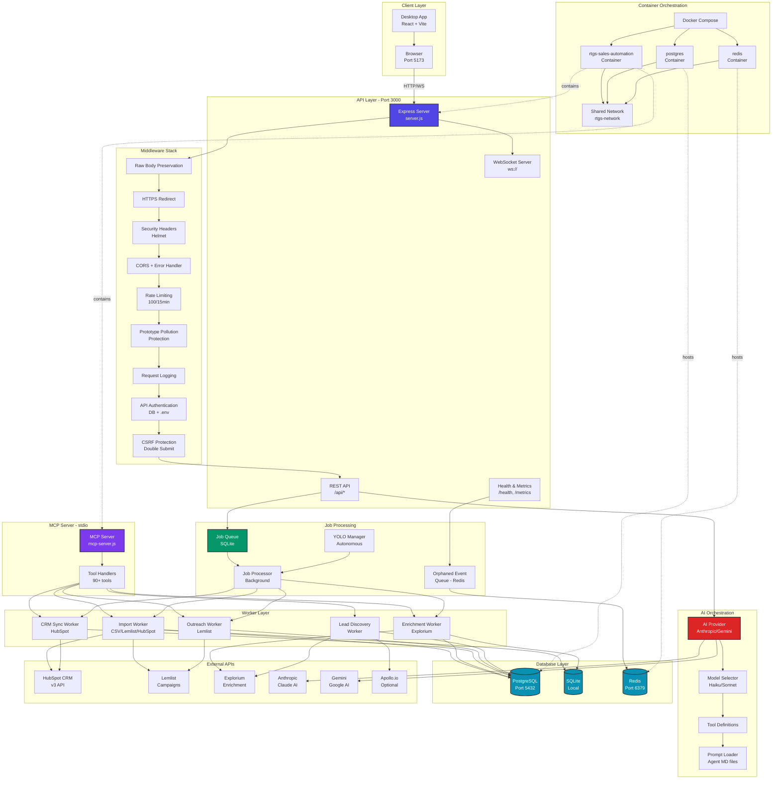
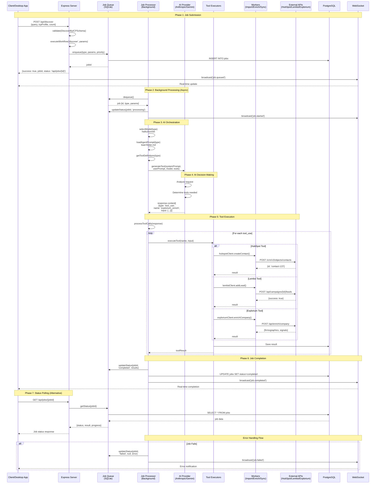
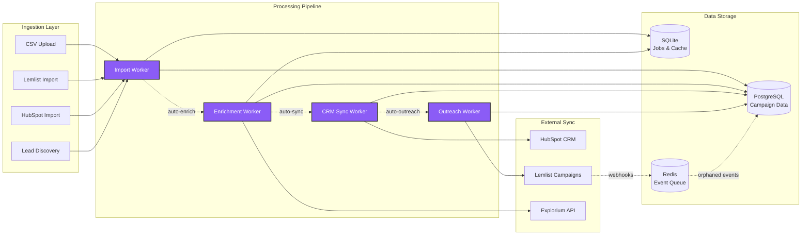
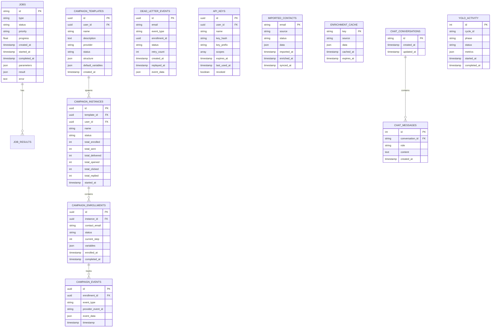

# Sales Automation Platform - System Architecture

## 1. High-Level System Architecture



## 2. AI Workflow Execution Flow



## 3. Data Flow Architecture



## 4. YOLO Mode Autonomous Flow

```mermaid
stateDiagram-v2
    [*] --> Disabled

    Disabled --> Enabled: POST /api/yolo/enable<br/>{config}
    Enabled --> Paused: POST /api/yolo/pause
    Paused --> Enabled: POST /api/yolo/resume
    Enabled --> Disabled: POST /api/yolo/disable
    Paused --> Disabled: POST /api/yolo/disable

    state Enabled {
        [*] --> Discovery

        Discovery --> Enrichment: Auto-trigger
        note right of Discovery
            Cron: Daily 8am
            - Search ICP matches
            - Score leads
            - Store in DB
        end note

        Enrichment --> CRMSync: Auto-trigger
        note right of Enrichment
            - Explorium enrichment
            - Generate intelligence
            - Quality scoring
        end note

        CRMSync --> Outreach: Auto-trigger
        note right of CRMSync
            - Deduplicate
            - Create/update in HubSpot
            - Associate companies
        end note

        Outreach --> Monitoring: Auto-trigger
        note right of Outreach
            - Add to Lemlist campaigns
            - Start sequences
            - Track enrollment
        end note

        Monitoring --> Discovery: Cron schedule
        note right of Monitoring
            Cron: Every 2 hours
            - Check replies
            - Classify sentiment
            - Create follow-up tasks
        end note
    }

    state EmergencyStop {
        Enabled --> EmergencyStop: POST /api/yolo/emergency-stop
        EmergencyStop --> Paused: Immediate halt
        note right of EmergencyStop
            - Stop all cron jobs
            - Pause active campaigns
            - Log incident
        end note
    }
```

## 5. Database Architecture



## 6. Security Architecture

```mermaid
graph TB
    subgraph "Request Pipeline"
        A[Incoming Request]
        A --> B{Origin Check}
        B -->|Invalid| C[403 CORS Error]
        B -->|Valid| D[HTTPS Redirect]
        D --> E[Security Headers<br/>Helmet]
        E --> F[Rate Limiter<br/>100/15min]
        F -->|Exceeded| G[429 Too Many]
        F -->|OK| H{Route Type}

        H -->|Public| I[/health, /dashboard, /webhooks]
        H -->|API| J[Auth Check]

        J --> K{DB Auth Available}
        K -->|Yes| L[Database Auth<br/>Argon2id]
        K -->|No| M[.env Auth<br/>Fallback]

        L -->|Invalid| N[401 Unauthorized]
        M -->|Invalid| N
        L -->|Valid| O{CSRF Check}
        M -->|Valid| O

        O -->|POST/PUT/DELETE| P[Verify CSRF Token]
        O -->|GET/HEAD| Q[Process Request]

        P -->|Invalid| R[403 CSRF Error]
        P -->|Valid| Q

        Q --> S[Prototype Pollution<br/>Protection]
        S --> T[Request Handler]
    end

    subgraph "API Key Management"
        U[Create API Key]
        U --> V[Generate Secure Key<br/>32 bytes crypto]
        V --> W[Hash with Argon2id<br/>timeCost:3, mem:65536]
        W --> X[Store Hash + Prefix]
        X --> Y[Return Plain Key<br/>ONCE]
    end

    subgraph "CSRF Protection"
        Z1[Client Requests<br/>/api/csrf-token]
        Z1 --> Z2[Generate Token<br/>UUID v4]
        Z2 --> Z3[Store in Redis<br/>TTL: 1 hour]
        Z3 --> Z4[Set Cookie<br/>SameSite:Strict]
        Z4 --> Z5[Client Includes<br/>X-CSRF-Token Header]
        Z5 --> Z6[Verify: Cookie = Header<br/>AND Redis Entry Exists]
    end

    style C fill:#dc2626,color:#fff
    style G fill:#dc2626,color:#fff
    style N fill:#dc2626,color:#fff
    style R fill:#dc2626,color:#fff
    style Q fill:#059669,color:#fff
    style T fill:#059669,color:#fff
```

## Architecture Analysis

### 1. Compliance with Architectural Principles

**SOLID Principles:**
- ✅ **Single Responsibility**: Each worker has one clear purpose (Import, Enrich, CRM Sync, Outreach)
- ✅ **Open/Closed**: AI Provider abstraction allows adding new providers (Gemini, Anthropic) without modifying core
- ✅ **Liskov Substitution**: AIProvider interface enables swapping between Anthropic/Gemini transparently
- ✅ **Interface Segregation**: Clients expose only relevant methods (HubSpot, Lemlist, Explorium)
- ✅ **Dependency Inversion**: High-level modules depend on abstractions (AIProvider, not concrete Anthropic)

**Architectural Patterns:**
- ✅ **Layered Architecture**: Clear separation (API → Workers → Clients → External APIs)
- ✅ **Repository Pattern**: Database abstraction (JobQueue, Database utilities)
- ✅ **Strategy Pattern**: AI model selection (Haiku for speed, Sonnet for intelligence)
- ✅ **Observer Pattern**: Event-driven automation (import → enrich → sync → outreach)
- ✅ **Queue-Based Processing**: Background job execution with Job Queue

### 2. Component Boundaries & Coupling

**Strong Boundaries:**
- ✅ API Layer: Express server isolated from business logic
- ✅ Worker Layer: Each worker is independent, communicates via database
- ✅ Client Layer: External API clients are isolated and mockable
- ✅ Database Layer: Dual storage (PostgreSQL for production data, SQLite for jobs/cache)

**Coupling Metrics:**
- **API Server** → Workers: Low coupling (via Job Queue)
- **Workers** → Clients: Medium coupling (direct instantiation, but interface-based)
- **MCP Server** → Workers: Direct coupling (could be improved with event bus)

**Potential Circular Dependencies:**
- ⚠️ **server.js** imports Workers, Workers import Clients - linear, no circles detected
- ✅ No circular dependencies found in import analysis

### 3. Microservice Boundaries (Future Consideration)

**Potential Service Decomposition for Scale:**

1. **API Gateway Service** (Current: server.js)
   - HTTP/WebSocket endpoints
   - Authentication, CSRF, rate limiting
   - Request routing

2. **Job Processing Service** (Current: Job Queue + Workers)
   - Background job orchestration
   - Worker execution
   - Result aggregation

3. **AI Orchestration Service** (Current: AI Provider + Tool Executors)
   - AI model selection
   - Tool definition management
   - Prompt loading and execution

4. **Campaign Service** (Partially extracted)
   - Campaign management
   - Enrollment tracking
   - Event processing

5. **Integration Service** (Current: Clients)
   - HubSpot, Lemlist, Explorium adapters
   - Rate limiting per provider
   - Retry logic

### 4. Architectural Risks & Technical Debt

**Current Risks:**

1. **Risk: SQLite for High-Volume Jobs**
   - **Impact**: SQLite may become bottleneck at scale
   - **Mitigation**: Migrating job queue to PostgreSQL or Redis-based queue (BullMQ)
   - **Evidence**: `/home/omar/claude - sales_auto_skill/sales-automation-api/src/utils/job-queue.js` uses SQLite

2. **Risk: Synchronous AI Tool Execution**
   - **Impact**: Long-running tool calls block job processor
   - **Mitigation**: Implement async tool execution with timeout handling
   - **Evidence**: `processToolCalls()` in server.js processes tools sequentially

3. **Risk: Missing Circuit Breaker for External APIs**
   - **Impact**: Cascading failures from HubSpot/Lemlist/Explorium downtime
   - **Mitigation**: Implement circuit breaker pattern (e.g., using `opossum`)
   - **Evidence**: No resilience layer in client files

4. **Risk: Orphaned Event Queue Processing**
   - **Impact**: Redis memory growth if events aren't drained
   - **Mitigation**: TTL on Redis keys + monitoring queue depth
   - **Evidence**: `/home/omar/claude - sales_auto_skill/sales-automation-api/src/server.js` lines 2064-2156

**Technical Debt:**

1. **Dual Database System Complexity**
   - PostgreSQL for campaigns, SQLite for jobs
   - Should consolidate to single database (PostgreSQL)

2. **Mixed Authentication Strategy**
   - Database auth with .env fallback
   - Should complete migration to database-only auth

3. **WebSocket Broadcasting Without Rooms**
   - All clients receive all messages
   - Should implement user-scoped rooms

### 5. Scalability Assessment

**Current Limits (MVP for <10 users):**
- ✅ Single Node.js process handles all traffic
- ✅ SQLite for job queue (good for low volume)
- ✅ In-memory WebSocket connections
- ⚠️ No horizontal scaling capability

**Scaling Path (10-100 users):**
1. Migrate job queue to PostgreSQL or Redis
2. Implement WebSocket room partitioning
3. Add connection pooling for external APIs
4. Introduce job processor clustering

**Scaling Path (100+ users):**
1. Extract workers into separate service
2. Implement message queue (RabbitMQ/Kafka)
3. Horizontal scaling with load balancer
4. Distributed caching (Redis cluster)

### 6. Recommendations

**Immediate (No Breaking Changes):**
1. ✅ Add circuit breaker for external API calls
2. ✅ Implement timeout handling for AI tool execution
3. ✅ Add Prometheus metrics for job queue depth
4. ✅ Document service boundaries in code comments

**Short-term (Minor Refactoring):**
1. 🔄 Migrate job queue from SQLite to PostgreSQL
2. 🔄 Consolidate authentication to database-only
3. 🔄 Add event bus for worker decoupling
4. 🔄 Implement WebSocket rooms for user isolation

**Long-term (Major Architecture Changes):**
1. 📅 Extract workers into separate microservice
2. 📅 Implement API Gateway pattern for routing
3. 📅 Add distributed tracing (OpenTelemetry)
4. 📅 Migrate to event-driven architecture (Kafka/RabbitMQ)

---

**Conclusion**: This is a well-architected MVP following SOLID principles and clear layering. The main architectural risks are scalability-related, not design flaws. The dual database strategy and synchronous job processing are acceptable for <10 users but should be addressed before scaling.
